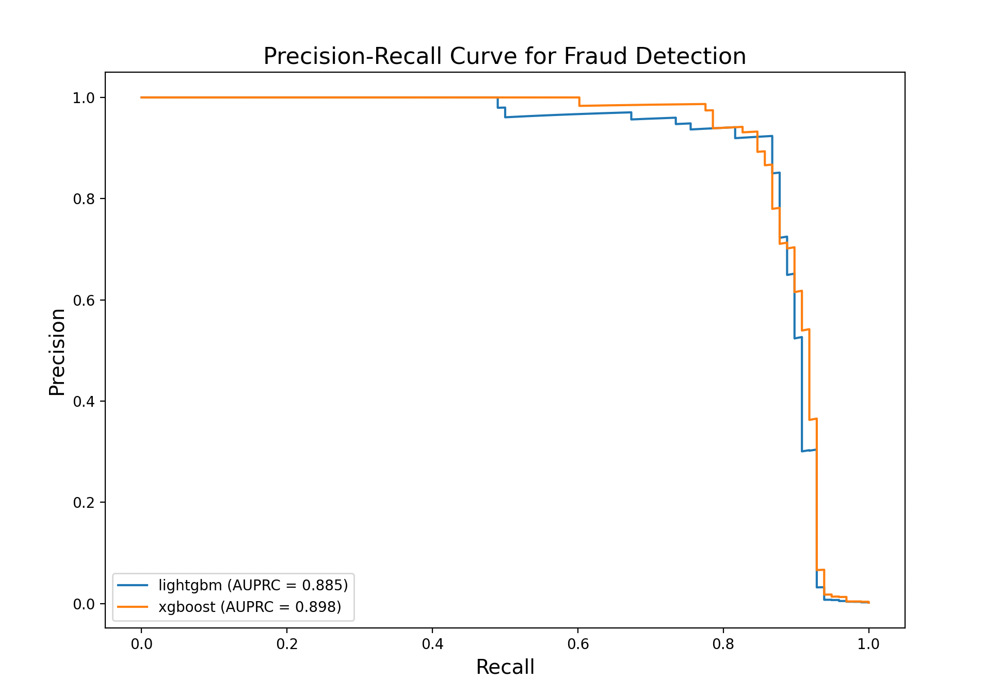

# Credit Card Fraud Detection

This repository contains a project based on the famous Kaggle Credi Card Fraud dataset, that can be found here 
https://www.kaggle.com/datasets/mlg-ulb/creditcardfraud/data.
The main focus here was to detect fraudulent credit card transactions using machine learning. What I did next was to build
and evaluate models that can accurately identify fraudulent transactions from a notoriously highly imbalanced set.

### Table of Contents

* [Introduction](#introduction)
* [Features](#features)
* [Directory Structure](#directory-structure)
* [Getting Started](#getting-started)
* [Usage](#usage)
* [Configuration](#configuration)
* [Model Performance](#model-performance)

### Introduction

This project focuses on the detection of credit card fraud. The dataset used is the "Credit Card Fraud Detection" dataset
from Kaggle, which is known for its severe class imbalance, with fraudulent transactions making up only a tiny fraction
of the data (0.17%).

This project tries to explore the data, engineer relevant features, and trains two models: XGBoost and LightGBM. Some 
techniques were used, like SMOTE (Synthetic Minority Over-sampling Technique), in order to address the class imbalance
and improve the model performance.

### Features

In this project I tried to do an Exploratory Data Analysis (EDA), that can be found in the [Jupyter File](./notebooks/01_Exploratory_Data_Analysis.ipynb),
that tries to understand the dataset structure, identity patterns, and discover insights about normal vs fraudulent
transactions.

In [data_processing.py](src/data_processing.py) I tried to implement some feature engineering. The 'Time' feature is
transformed into cyclical features ('Hour_sin', 'Hour_cos') in order to capture the time of the day when the transaction
happened, which can be a valuable insight in fraud detection.

The SMOTE technique mentioned also earlier, can be found in the same file, and is applied to the training data in order 
to enhance the minority class, here the frauds, helping the models to learn the characteristics of fraudulent transactions
maybe more easily.

Regarding the model training, this project implements a training pipeline for two popular and I think suited for this kind
of problem, tree-based models:
* XGBoost
* LightGBM

To evaluate the models I used as also recommended by the Kaggle team, I used for accuracy the Area Under the 
Precision-Recall Curve (AUPRC). Due to the nature of extreme class imbalance other choices, like the naive accuracy or 
confusion matrix aren't good enough here. The sheer number of non-fraudulent transactions will dwarf the fraudulent ones.

### Directory Structure

```plaintext
.
├── README.md
├── config
│   ├── base_config.yaml
│   ├── lgbm_config.yaml
│   └── xgboost_config.yaml
├── data
│   ├── X_test_scaled.csv
│   ├── creditcard.csv
│   ├── preprocessed
│   │   ├── preprocess_data.npz
│   │   └── test_data.npz
│   └── y_test.csv
├── models
│   ├── lightgbm.joblib
│   └── xgboost.joblib
├── notebooks
│   └── 01_Exploratory_Data_Analysis.ipynb
├── requirements.txt
└── src
    ├── data_processing.py
    ├── evaluate.py
    ├── models
    │   └── tree_model.py
    └── train.py
```

* `config` contains YAML files for configuring the models and data paths
* `data` where the raw and processed data is stored
* `models` where the trained models are stored
* `notebooks` contains Jupyter Notebook for EDA
* `src` python source code for data processing, training and evaluation
* `requirements.txt` required packages for this project

### Getting Started

In order to get this up and running please do the following:

#### Pre-requisites:

* Python 3.x
* pip

#### Pre-requisites:

1. Clone the repo
    `git clone git@github.com:RaresPopa22/FraudDetection.git`
2. Install Python packages
    `pip install -r requirements.txt`
3. Download the dataset
    Download the dataset 'Credit Card Fraud' from [Kaggle](https://www.kaggle.com/datasets/mlg-ulb/creditcardfraud/data#:~:text=Download)

### Usage

You can choose to train the models, or use the saved models, and evaluate their performance using the script in the src/
directory.

#### Training the Models

In order to train a model, run the `train.py` script with the desired configuration:

* Train XGBoost
    `python -m src.train --config config/xgboost_config.yaml`
* Train LightGBM
    `python -m src.train --config config/lgbm_config.yaml`

If you want to tune yourself the params, please add the `--tune` flag to your train model command.

#### Evaluating the models

After training, you can evaluate and compare the models using the evaluate.py script:
` python -m src.evaluate --models models/lightgbm.joblib models/xgboost.joblib --x-test data/X_test_scaled.csv --y-test data/y_test.csv`

This will print a classification report for each model, a comparison summary, and will plot a Precision-Recall curve plot.

### Configuration

This project uses YAML files for configuration, making it easy to manage model parameters and data paths.

* `base_config.yaml` contains the base configuration, including data paths
* `xgboost_config.yaml` and `lgbm_config.yaml` contains model-specific parameters

### Model Performance

The models were evaluated on a held-out test set to assess their real-world performance on unseen data. Given the highly
imbalanced nature of the dataset, the Area Under Precision-Recall Curve (AUPRC) is the metric used for comparison.

The table below summarizes the performance of the two models. Both they did kinda good, with XGBoost having a slight edge
here.

| Model   | AUPRC  | ROC AUC      | Recall (Fraud) | Precision (Fraud) | F1-Score (Fraud) |
|---------|--------|--------------|----------------|-------------------|------------------|
| XGBoost | 0.8976 | 0.974 |  0.88 | 0.77 |  0.82 |
| LGBM    | 0.8850 |  0.9831 |  0.88 |  0.80  | 0.83 |

The Precision-Recall curve visualizes the trade-off between precision and recall for different thresholds. A model with
a curve closer to the top right corner indicates a better performance. As seen below, both did well, confirming their 
efficiency in identifying fraudulent transactions, while minimizing false positives.




Raw report:
```
Loaded test data. X_test shape: (56962, 31), y_test shape: (56962,)
Evaluating Model: lightgbm.joblib
Classification Report:
              precision    recall  f1-score   support

   Non Fraud       1.00      1.00      1.00     56864
       Fraud       0.80      0.88      0.83        98

    accuracy                           1.00     56962
   macro avg       0.90      0.94      0.92     56962
weighted avg       1.00      1.00      1.00     56962

Evaluating Model: xgboost.joblib
Classification Report:
              precision    recall  f1-score   support

   Non Fraud       1.00      1.00      1.00     56864
       Fraud       0.77      0.88      0.82        98

    accuracy                           1.00     56962
   macro avg       0.89      0.94      0.91     56962
weighted avg       1.00      1.00      1.00     56962

Model Comparison Summary
           AURPC  ROC AUC                                     Recall (Fraud)                                  Precision (Fraud)  F1-Score (Fraud)
Model                                                                                                                                            
lightgbm  0.8850   0.9748  [1.0, 1.0, 1.0, 1.0, 1.0, 1.0, 1.0, 1.0, 1.0, ...  [0.0017204452090867595, 0.0017204754130018785,...             0.835
xgboost   0.8976   0.9831  [1.0, 1.0, 1.0, 1.0, 1.0, 1.0, 1.0, 1.0, 1.0, ...  [0.0017204452090867595, 0.0017204754130018785,...             0.823
```
